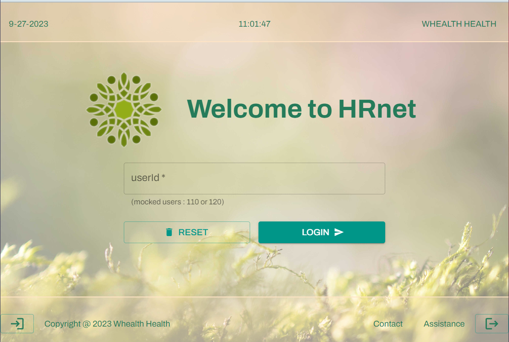

Openclassrooms Projet 14 : Faites passer une librairie jQuery vers React - Site Wealth Health : HRnet

Le contexte du projet :

- Mon profil : développeur front-end chez Wealth Health.
- L’entreprise : une grande société financière.
- La mission : aider la société à améliorer son application web interne HRnet de gestion des dossiers employés.
- L’objectif :
  - Faire passer l’application utilisant une librairie JQuery vers React.
  - Faire une nouvelle version des pages “Create Employee” et “Employee List”

Cahier des charges :

- Spécifications techniques :
  - L’ensemble de l’application doit être convertie en React
  - Ajout d’un système de gestion d’état
  - Optimiser le calendrier
  - Optimiser la pop-up de confirmation de création du dossier du personnel
  - Optimiser et stabiliser les menus déroulants
  - Optimiser le tableau des employés
  - Publication sur npm d’un des plugins convertie
  - Réaliser un test de performance et des tests manuels
- Spécifications fonctionnelles :
  - Créer une nouvelle version des pages de création d’employés et de la liste des employés
  - Améliorer le rendu du calendrier
  - Permettre la personnalisation de la pop-up de confirmation de création du dossier du personnel
  - Fluidifier l’utilisation des menus déroulants et de la liste des employés
  - S’assurer de la cohérence du style et éventuellement le moderniser

# Getting Started with Create React App

This project was bootstrapped with [Create React App](https://github.com/facebook/create-react-app).

## Available Scripts

In the project directory, you can run:

### `yarn start`

Runs the app in the development mode.\
Open [http://localhost:3000](http://localhost:3000) to view it in your browser.

The page will reload when you make changes.\
You may also see any lint errors in the console.

### `yarn test`

Launches the test runner in the interactive watch mode.\
See the section about [running tests](https://facebook.github.io/create-react-app/docs/running-tests) for more information.

### `yarn build`

Builds the app for production to the `build` folder.\
It correctly bundles React in production mode and optimizes the build for the best performance.

The build is minified and the filenames include the hashes.\
Your app is ready to be deployed!

See the section about [deployment](https://facebook.github.io/create-react-app/docs/deployment) for more information.

### `yarn eject`

**Note: this is a one-way operation. Once you `eject`, you can't go back!**

If you aren't satisfied with the build tool and configuration choices, you can `eject` at any time. This command will remove the single build dependency from your project.

Instead, it will copy all the configuration files and the transitive dependencies (webpack, Babel, ESLint, etc) right into your project so you have full control over them. All of the commands except `eject` will still work, but they will point to the copied scripts so you can tweak them. At this point you're on your own.

You don't have to ever use `eject`. The curated feature set is suitable for small and middle deployments, and you shouldn't feel obligated to use this feature. However we understand that this tool wouldn't be useful if you couldn't customize it when you are ready for it.

## Learn More

You can learn more in the [Create React App documentation](https://facebook.github.io/create-react-app/docs/getting-started).

To learn React, check out the [React documentation](https://reactjs.org/).

### Code Splitting

This section has moved here: [https://facebook.github.io/create-react-app/docs/code-splitting](https://facebook.github.io/create-react-app/docs/code-splitting)

### Analyzing the Bundle Size

This section has moved here: [https://facebook.github.io/create-react-app/docs/analyzing-the-bundle-size](https://facebook.github.io/create-react-app/docs/analyzing-the-bundle-size)

### Making a Progressive Web App

This section has moved here: [https://facebook.github.io/create-react-app/docs/making-a-progressive-web-app](https://facebook.github.io/create-react-app/docs/making-a-progressive-web-app)

### Advanced Configuration

This section has moved here: [https://facebook.github.io/create-react-app/docs/advanced-configuration](https://facebook.github.io/create-react-app/docs/advanced-configuration)

### Deployment

This section has moved here: [https://facebook.github.io/create-react-app/docs/deployment](https://facebook.github.io/create-react-app/docs/deployment)

### `yarn build` fails to minify

This section has moved here: [https://facebook.github.io/create-react-app/docs/troubleshooting#npm-run-build-fails-to-minify](https://facebook.github.io/create-react-app/docs/troubleshooting#npm-run-build-fails-to-minify)
